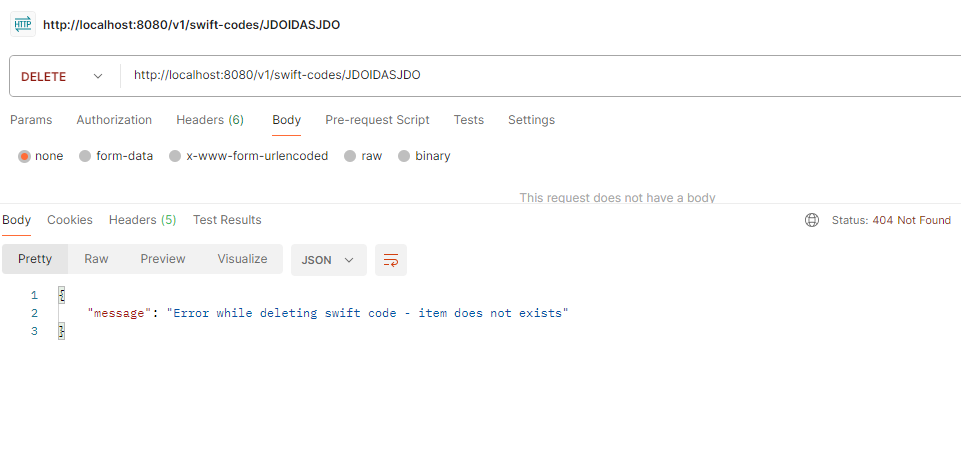

# REMITLY Summer Internship 2025 Recruitment Exercise


## 📝 **Table of contents**
* [General info](#general-info)
* [Setup](#setup)
* [Run](#run)
* [Test](#test)
* [Errors](#errors)
---

## General Info

This application was made for the recruitment process at Remitly.
It exposes a REST API that manages SWIFT codes and allows users to:
- retrieve bank information by SWIFT code or country code
- add new SWIFT Code
- delete records

REST API was written in Java 21 with SpringBoot 3.4.4 framework.<br>
All data is stored in PostgreSQL database.<br>
Application can be deployed on any device thanks to docker containerization.


## Setup

Clone the repository and select proper directory

```
git clone https://github.com/CoderMike1/internship_recruitment_task.git

cd internship_recruitment_task
```

Run docker compose, make sure to have your docker installed and you are logged in

```
docker login    
docker-compose up --build
```

After a while, app is launched and ready!<br>
It's listening on http://localhost:8080/

## Run


### 1. Retrieve information of a bank by swift code

#### Request:
- Request method:<br>
``
GET /v1/swift-codes/{swift-code}
``
- Example request:<br>
``
http://localhost:8080/v1/swift-codes/BIGBPLPWCUS
``
#### Response:
- Response success code:<br>
``200``
- Response structure:<br>
    - for headquarter swift code
    ```
   {
    "address": string,
    "bankName": string,
    "countryISO2": string,
    "countryName": string,
    "isHeadquarter": bool,
    "swiftCode": string
    “branches”: [
             {
               "address": string,
               "bankName": string,
               "countryISO2": string,
               "isHeadquarter": bool,
               "swiftCode": string
             },
             {
               "address": string,
               "bankName": string,
               "countryISO2": string,
               "isHeadquarter": bool,
               "swiftCode": string
             }, . . .
               ]
    }
    ```
    - for branch swift code
  ```
  {
    "address": string,
    "bankName": string,
    "countryISO2": string,
    "countryName": string,
    "isHeadquarter": bool,
    "swiftCode": string
  }
  ```
- Response example:<br>
    - for headquarter swift code
  ```
    {
    "address": "LOPUSZANSKA BUSINESS PARK LOPUSZANSKA 38 D WARSZAWA, MAZOWIECKIE, 02-232",
    "bankName": "ALIOR BANK SPOLKA AKCYJNA",
    "countryISO2": "PL",
    "countryName": "POLAND",
    "isHeadquarter": true,
    "swiftCode": "ALBPPLPWXXX",
    "branches": [
        {
            "address": "LOPUSZANSKA BUSINESS PARK LOPUSZANSKA 38 D WARSZAWA, MAZOWIECKIE, 02-232",
            "bankName": "ALIOR BANK SPOLKA AKCYJNA",
            "countryISO2": "PL",
            "isHeadquarter": false,
            "swiftCode": "ALBPPLPWCUS"
        }
      ]
    }
    ```
   - for branch swift code
  ```
  {
    "address": "  WARSZAWA, MAZOWIECKIE",
    "bankName": "ALIOR BANK SPOLKA AKCYJNA",
    "countryISO2": "PL",
    "countryName": "POLAND",
    "isHeadquarter": false,
    "swiftCode": "ALBPPLP1BMW"
  }  
  ```

### 2. Retrieve information of a banks by country code

#### Request:
- Request method:<br>
  ``
  GET /v1/swift-codes/country/{countryISO2code}
  ``
- Example request:<br>
  ``
  http://localhost:8080/v1/swift-codes/country/PL
  ``
#### Response:
- Response success code:<br>
  ``200``
- Response structure:<br>
    ```
    {
    "countryISO2": string,
    "countryName": string,
    "swiftCodes": [
        {
            "address": string,
    		 "bankName": string,
    		 "countryISO2": string,
    		 "isHeadquarter": bool,
    		 "swiftCode": string
        },
        {
            "address": string,
    		 "bankName": string,
    		 "countryISO2": string,
    		 "isHeadquarter": bool,
    		 "swiftCode": string
        }, . . .
      ]
    }
    ```
- Response example:
    ```
  {
    "countryISO2": "CA",
    "countryName": "CANADA",
    "swiftCodes": [
        {
            "address": "Gold 89b",
            "bankName": "GoldenBank",
            "countryISO2": "CA",
            "isHeadquarter": false,
            "swiftCode": "AABBCCDDEE99"
        }
      ]
  }
    ```

### 3. Add new Swift code

#### Request:
- Request method:<br>
  ``
  POST /v1/swift-codes
  ``
  ``
  Content-type: application/json
  ``
- Request body:<br>
   ```
   {
    "address": string,
    "bankName": string,
    "countryISO2": string,
    "countryName": string,
    “isHeadquarter”: bool,
    "swiftCode": string,
   }
   ```
- Example request:<br>
  ``
  http://localhost:8080/v1/swift-codes/country/PL
  ``
  ```
  {
    "address": "Gold 89b",
    "bankName": "GoldenBank",
    "countryISO2":"CA",
    "countryName": "Canada",
    "isHeadquarter": false,
    "swiftCode": "AABBCCDDEE99"
  }
  ```
#### Response:
- Response success code:<br>
  ``201``
- Response structure:
  ```
  {
    "message": string,
  }
  ```
- Response example:
  ```
  {
    "message": "Successfully added new swift code"
  }
  ```

### 4. Delete Swift code record

#### Request:
- Request method:<br>
  ``
  DELETE /v1/swift-codes/{swift-code}
  ``
- Example request:<br>
  ``
  http://localhost:8080/v1/swift-codes/AABBCCDDEE99
  ``
#### Response:
- Response success code:<br>
  ``200``
- Response structure:
  ```
  {
    "message": string,
  }
  ```
- Response example:
  ```
  {
    "message": "Successfully deleted swift code 'AABBCCDDEE99'"
  }
  ```

## Test

### Application is tested while building a image

## Errors 

### Application catches the edge cases of wrong payload / wrong behaviour and returns to user error message

<hr>

<hr>

<hr>

